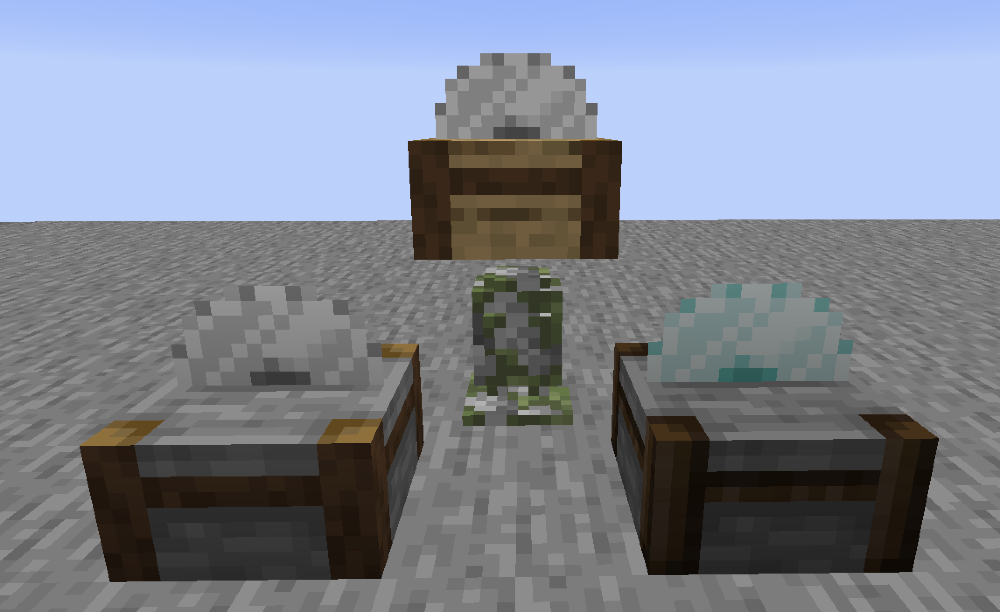

# CraftyItems

CraftyItems is a Minecraft mod for the Fabric loader which adds
and currently plans to add tons of new and creative ways to
craft things.

### Features

- **Small quirks and QoL updates**
, as they help enhance the experience while playing, like stew
cooking pots
- **Elemental and Natural elements** from which a complex tree of
recipes starts to grow surprisingly well
- **Compatibility with popular mods** so you won't miss any
of the good stuff!
- **And much more to come!**

---
## Screenshots

*Note: Some of these screenshots are taken during development, this WILL change, so nothing that you see it truly final*
---

## Will it be ported to Forge?
Short answer, **maybe**, long answer: \
Forge is a good modding library and their mappings are generally good.
Modders tend to go with it thanks to the enormous historical contributions
that Forge mods gave to Minecraft in general, and also thanks to the great
community support. However, Fabric is more easy to work with,
it has less restrains when coming to quick updates and ships with a **Mixin Library**
by default, which is extremely convenient to use when modding certain aspects of the game
without hacky "ASM cheese" or hooks.
Nothing to say against Forge, but I don't know if it will ever be worth
my time adding compatibility.

### Do you know about Architectury API?
Yes I know about them. However, I don't quite feel like their API
is complete enough to provide that freedom of movement that each individual
loader gives. If I really need to do cross-loading, I will just use the
"resources-to-common-dir" strategy.

*Also, I am planning to use Kotlin later on, :)*

### Is this a troll mod?
`:troll:` (no, but trust me, when I started the mod that amogus statue was necessary, vital, even)

# Contributors
**SweetieRick**, myself :) \
Special thanks to **SolelyMods** for his help and knowledge of Minecraft's obscure methods; \
**Dale**, for his contribution to the optimization of this mod; \
**roro1506_HD#2708** on Discord for his help on method hunt; \
**deirn#0100** on Discord for his patience in figuring out my typos (sorry man)

# License
This project is licenced under the permissive MIT license.
To see what you can and can't do with this project, please
refer to the [LICENSE file](LICENSE)